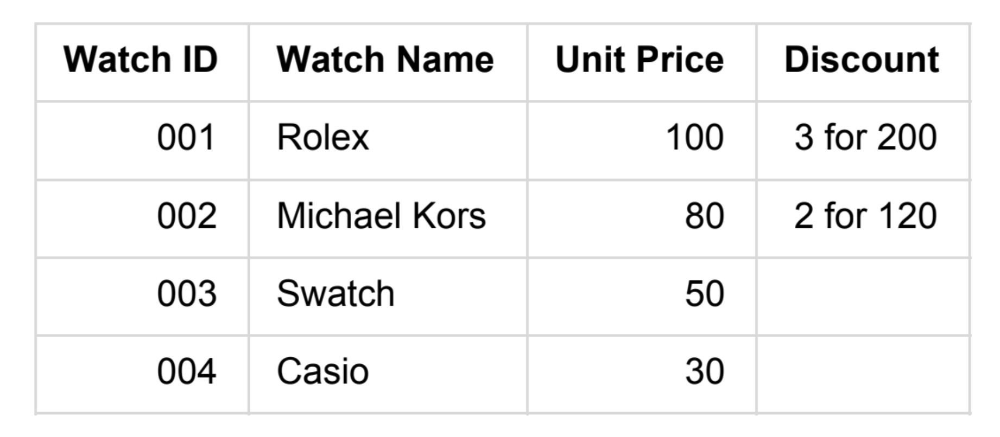

# Watch store API

## Introduction
This application totals up the price of a number of watches according to the catalog shown below.



It receives an input of a single JSON array of watch IDs and outputs an total price.

It is served on Flask and relies on a Watch class to define the properties of each type of watch and track their counts. The catalogue is stored as an array of the four current watch types. This structure allows for easy potential addition of new types of watches, which would be done by instantiating a new Watch. For watches with discounts, ```disc_num``` refers to the number of pieces needed to form a discount group, and ```disc_price``` is the price per group. Given these properties and the number of pieces, a subtotal price is calculated for each watch type. These are all totalled up in the end. 

Upon receipt of an array, the API parses the data and tallies the number of pieces for each type of watch. Then the count value of each Watch instance in the catalogue is set accordingly. The calculations are then performed to return the total price. 

If there asked for a watch ID that is not present in the catalog, the API returns a bad request. 

## Run app

### Install dependencies 
```bash
# Create env
python -m venv env

# Enter venv
source env/bin/activate

# Download dependencies
pip install -r requirements.txt
```
### Start server
```bash
python watchstore.py
```
This starts the server and it is ready to take requests such as with curl or Postman

### Testing
```bash
python test_watchstore.py
```
Custom test cases can be added in ```test_watchstore.py``` by creating an input array of watch IDs and the expected price. 

## Improvements
The application can be improved with more modular test structure and more granular testing, such as of the header values. 
The catalog and calculation functionality could also be moved to a module separate from the Flask app.


#### Author
Oorja Majgaonkar (ojm238@nyu.edu)